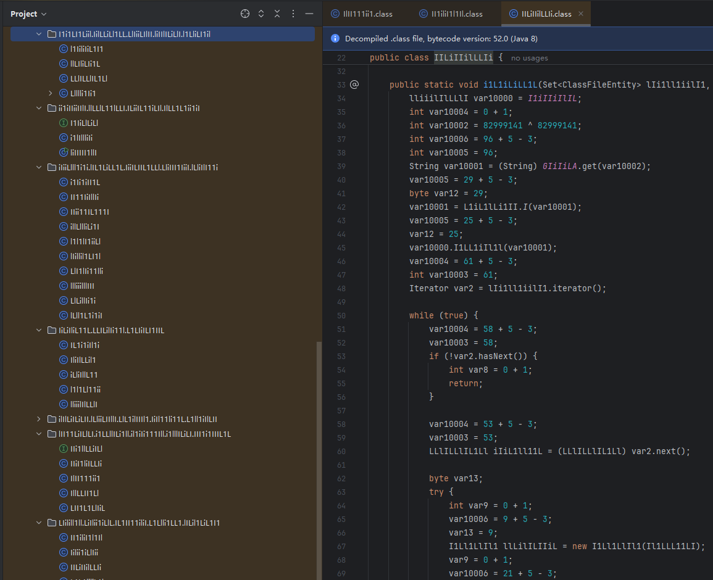
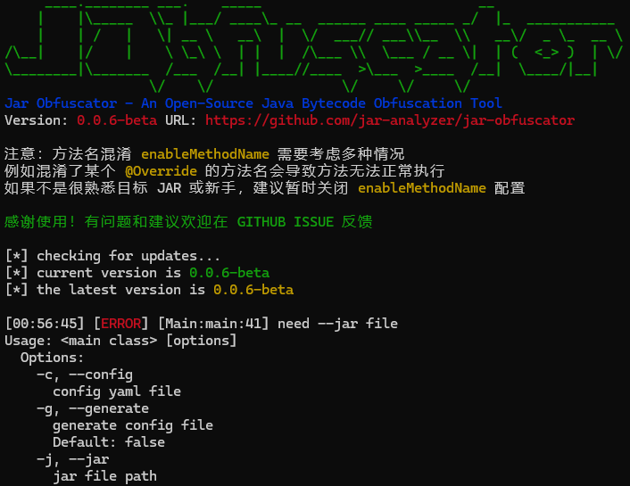

# Jar-Obfuscator


[CHANGE LOG](CHANGELOG.MD)

`Jar Obfuscator` 是一个 `JAR/CLASS` 文件混淆工具

- 命令行模式，简单易用
- 仅单个 `JAR` 文件小于 `1 MB` 超轻量
- 简洁的配置文件快速上手
- 输入 `JAR` 直接输出混淆后的 `JAR`



## 开始

[前往下载](https://github.com/jar-analyzer/jar-obfuscator/releases/latest)

简单命令即可启动（第一次启动将自动生成配置文件）

```shell
java -jar jar-obfuscator.jar --jar test.jar --config config.yaml
```



支持的混淆内容

- 类名混淆（包含引用修改）
- 包名混淆（包含引用修改）
- 方法名混淆（包含引用修改）
- 字段名混淆（包含引用修改）
- 方法内参数名混淆（包含引用修改）
- 删除编译调试信息（删除行号信息）
- 字符串加密运行时解密（使用 `AES` 加密）
- 字符串提取数组混淆（访问数组方式得到字符串）
- 整型常数异或混淆（多重异或的加密）
- 垃圾代码花指令混淆（可指定多级别的混淆）
- 使用某些技巧可以在反编译时隐藏方法
- 使用某些技巧可以在反编译时隐藏字段
- 安全的随机（支持通过 `CPU` 指令获得随机数）
- 基于 `JVMTI` 的字节码加密（beta）

其中 `包含引用修改` 的功能可能因为修改引用导致程序出问题

## 配置

类名/包名/方法名/字段名的混淆需要分析整体项目的依赖引用
- 类名混淆 `enableClassName`
- 包名混淆 `enablePackageName`
- 方法混淆 `enableMethodName`
- 字段混淆 `enableFieldName`

由于需要修改引用，可能出现预期外的情况

以下混淆不修改引用，相对稳定靠谱，如遇报错可以搭配使用以下配置
- 开启 `enableEncryptString` 和 `enableAdvanceString` 加密字符串
- 开启 `enableJunk` 花指令混淆
- 开启 `enableXOR` 对数字进行异或加密

注意：如果 `obfuscatePackage` 和 `rootPackages` 都不配置，其他的配置不会生效（系统不知道需要对哪些类混淆）

**一个新手上手应该做的是**
- `mainClass` 填写你的主类名
- `obfuscatePackage` 填写你需要混淆的包名（必须）
- `rootPackages` 填写你项目的根包（分析和修改引用的范围 必须）
- 其他可选配置**按需配置**即可
- 如果要开启 `enableMethodName` 需要自行调参黑名单

随机数的来源可以配置 `useCpuRDRAND` 参数
- 直接通过 `CPU` 的 `RDRAND` 指令生成
- 使用 `SecureRandom` 生成

```asm
get_rand_int PROC
    mov rdi, rdi
    test rdi, rdi
    je fail
    rdrand eax
    jc success
fail:
    xor eax, eax
    ret
success:
    mov [rdi], eax
    mov eax, 1
    ret
get_rand_int ENDP
```

参考配置

```yaml
# jar obfuscator 配置文件
# jar obfuscator by jar-analyzer team (4ra1n)
# https://github.com/jar-analyzer/jar-obfuscator

# 日志级别
# debug info warn error
logLevel: info

# 主类名
# 不设置主类名可能无法正常执行主函数
# 1. 遇到主类名会记录混淆后的新主类名
# 2. 替换 MANIFEST.MF 中的主类名
# 这样的操作可以使 java -jar 仍然可以正常启动
mainClass: me.n1ar4.jar.obfuscator.Main
# 自动修改 META-INF 的主类配置
# 除非你的项目不含主类只是纯库函数
modifyManifest: true

# 混淆字符配置
# 类名方法名等信息会根据字符进行随机排列组合
obfuscateChars: [ i, l, L, '1', I ]
# 混淆包名称 必须配置否则无法运行
# 建议仅设置关键部分不要设置范围过大
# 不需要通配符 只写 a.b.c 包名即可
# 如果配置 a.b 会混淆 a.b.X 和 a.b.c.X 等以此类推
obfuscatePackage: [ me.n1ar4, org.n1ar4 ]
# 需要混淆的根包名
# 避免处理 org.apache 等无关 class
# 这个配置主要的意义是分析引用关系时仅考虑该配置下的
rootPackages: [ me.n1ar4, org.n1ar4 ]
# 不对某些类做混淆（不混淆其中的所有内容）
# 例如反射调用/JAVAFX FXML绑定等情况
classBlackList: [ javafx.controller.DemoController ]
# 不对指定正则的类进行混淆
# 注意这里的类名匹配是 java/lang/String 而不是 java.lang.String
# 该配置和 classBlackList 同时生效
classBlackRegexList: [ java/.*, com/intellij/.* ]
# 不对某些 method 名做混淆 正则
# visit.* 忽略 JAVA ASM 的 visitCode visitMethod 等方法
# start.* 忽略 JAVAFX 因为启动基于 start 方法
# 以此类推某些方法和类是不能混淆的（类继承和接口实现等）
methodBlackList: [ visit.*, start.* ]

# 开启类名混淆
enableClassName: true
# 开启包名混淆（仅混淆 obfuscatePackage 配置）
enablePackageName: true
# 开启方法名混淆 - 不稳定
enableMethodName: false
# 开启字段混淆
enableFieldName: true
# 开启参数名混淆
enableParamName: true

# 开启加密字符串
enableEncryptString: true
# 加密使用 AES KEY
# 注意长度必须是 16 且不包含中文
stringAesKey: Y4SuperSecretKey
# 开启进阶字符串混淆
enableAdvanceString: true
# 进阶字符串处理参数
advanceStringName: GIiIiLA
# 字符串解密类名
decryptClassName: org.apache.commons.collections.list.AbstractHashMap
# 字符串解密方法名
decryptMethodName: newMap
# 字符串 AES KEY 名字
decryptKeyName: LiLiLLLiiiLLiiLLi

# 是否隐藏方法
# 给混淆方法添加 ACC_SYNTHETIC 可以在反编译时隐藏
# 参考 Y4tacker 的 HackingFernFlower
# 仅在混淆方法开启时生效
enableHideMethod: true
# 是否隐藏字段
# 给字段添加 ACC_SYNTHETIC 可以在反编译时隐藏
# 参考 Y4tacker 的 HackingFernFlower
# 仅在混淆字段开启时生效
enableHideField: true

# 开启删除编译信息选项
enableDeleteCompileInfo: true
# 开启数字异或混淆
enableXOR: true

# 开启花指令混淆
enableJunk: true
# 花指令级别
# 最低1 最高5
# 使用 3 以上会生成垃圾方法
junkLevel: 5
# 一个类中的花指令数量上限
maxJunkOneClass: 2000

# 是否打印所有主函数
showAllMainMethods: true

# 是否开启进阶 JVMTI 加密字节码
# 注意仅支持 WINDOWS 和 LINUX 且不一定稳定
enableSuperObfuscate: false
# 加密 KEY 配置
# 注意长度必须是 16 位
superObfuscateKey: 4ra1n4ra1n4ra1n1
# 加密包名配置
superObfuscatePackage: me.n1ar4

# 是否保留临时类文件
keepTempFile: false

# 是否使用 CPU 的 rdrand 指令获取随机数
# 如果报错请设置为 FALSE
useCpuRDRAND: true
```

## 混淆效果

参考 [文档](doc/README-result.md)

## 配置示例

参考 [文档](doc/README-example.md)

## 关于 JVMTI 字节码加密

参考 [文档](doc/README-advance.md)

## BUILD

对于 `JAVA` 层提供了 `docker` 构建方式

- ./docker-build.sh

构建完成后，当前目录会出现一个 `jar-obfuscator.jar` 文件

`JAVA` 层构建

- JDK 8
- Maven

JVMTI / JRandom 的构建

- Windows: MSVC + ml64 + CMake 3.x
- Linux: gcc + nasm + CMake 3.x
- Optional: Python 3.x

目前不支持 `MacOS` 系统，欢迎大佬提交 `PR`

