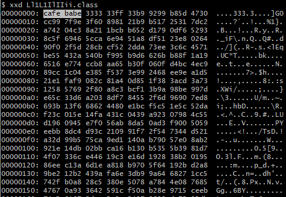

# Jar-Obfuscator

`Jar-Obfuscator` 是一个 `JAR/CLASS` 文件混淆工具

- 命令行模式，简单易用
- 仅单个 `JAR` 文件轻量启动
- 简洁的配置文件快速上手

## 开始

简单命令即可启动（第一次启动将自动生成配置文件）

```shell
java -jar jar-obfuscator.jar --jar test.jar --config config.yaml
```

支持的混淆内容

- 类名混淆（包含引用）
- 方法名混淆（包含引用）
- 字段名混淆（包含引用）
- 方法内参数名混淆（包含引用）
- 删除编译调试信息（行号等）
- 字符串加密运行时解密（使用 `AES` 加密）
- 字符串提取数组混淆（访问数组方式得到字符串）
- 整型常数异或混淆（多重异或的加密）
- 垃圾代码花指令混淆（可指定多级别的混淆）
- 基于 `JVMTI` 的字节码加密（beta）

## 效果

测试类

```java
package com.test;

public class Hello {
    private static void add(int a, int b) {
        int c = a + b;
        System.out.println("a + b = " + c);
    }

    public static void main(String[] args) {
        add(1, 2);
    }
}
```

混淆后 `main` 方法部分指令 (全部指令过长不便显示)

```java
public static main([Ljava/lang/String;)V
    LDC 50917067
    LDC 133762565
    ICONST_0
    ICONST_1
    IADD
    POP
    IXOR
    LDC 83446414
    LDC 567873
    ICONST_0
    ICONST_1
    IADD
    POP
    IXOR
    ICONST_0
    ICONST_1
    IADD
    // ...
    POP
    POP
    POP
    INVOKESTATIC com/test/Ll1L1IlIIii.lLil1Ll11l1 (II)V
    // ...
```

混淆后 `main` 方法部分反编译代码 (全部代码过长不便显示)

```java
public static void main(String[] lLiIIiIiLlI) {
    int var10002 = 0 + 1;
    int var10000 = 50917067 ^ 133762565;
    int var10003 = 0 + 1;
    int var10001 = 83446414 ^ 567873;
    var10002 = 0 + 1;
    var10000 ^= var10001;
    var10003 = 0 + 1;
    var10001 = 44140772 ^ 109412867;
    int var10004 = 0 + 1;
    var10002 = 25080190 ^ 89832347;
    var10003 = 0 + 1;
    var10001 ^= var10002;
    int var10005 = 54 + 5 - 3;
    byte var1 = 54;
    lLil1Ll11l1(var10000, var10001);
    var10000 = 0 + 1;
}
```

开启 `JVMTI` 加密的混淆效果

（该类是非法字节码无法直接运行也无法反编译）



如果开启该选项，比如启动时指定特殊本地库进行解密

## 配置文件

配置文件和选项参考

```yaml
# jar obfuscator 配置文件

# 日志级别
# debug info warn error
logLevel: info

# 主类名
# 不设置主类名可能无法正常执行主函数
mainClass: me.n1ar4.fake.gui.Application

# 混淆字符配置
obfuscateChars: [i, l, L, '1', I]
# 混淆包名称 必须配置否则无法运行
# 建议仅设置关键部分不要设置范围过大
obfuscatePackage: [me.n1ar4, org.n1ar4]

# 开启类名混淆
enableClassName: true
# 开启方法名混淆
enableMethodName: true
# 开启字段混淆
enableFieldName: true
# 开启参数名混淆
enableParamName: true

# 开启加密字符串
enableEncryptString: true
# 开启进阶字符串混淆
enableAdvanceString: true
# 进阶字符串处理参数
advanceStringName: GIiIiLA

# 开启删除编译信息选项
enableDeleteCompileInfo: true
# 开启数字异或混淆
enableXOR: true

# 开启花指令混淆
enableJunk: true
# 花指令级别
# 最低1 最高3
junkLevel: 3
# 一个类中的花指令数量上限
maxJunkOneClass: 2000

# 是否打印所有主函数
showAllMainMethods: true

# 是否开启进阶 JVMTI 加密字节码
enableSuperObfuscate: true
# 加密 KEY 配置
superObfuscateKey: 4ra1n4ra1n4ra1n1
# 加密包名配置
superObfuscatePackage: me.n1ar4
```