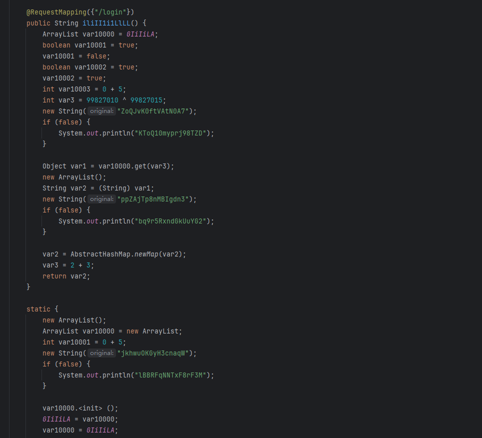
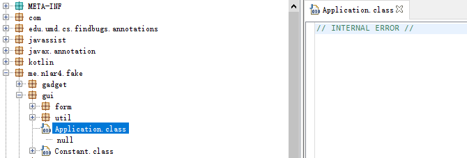
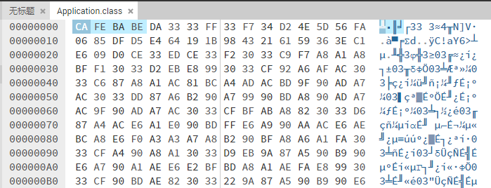
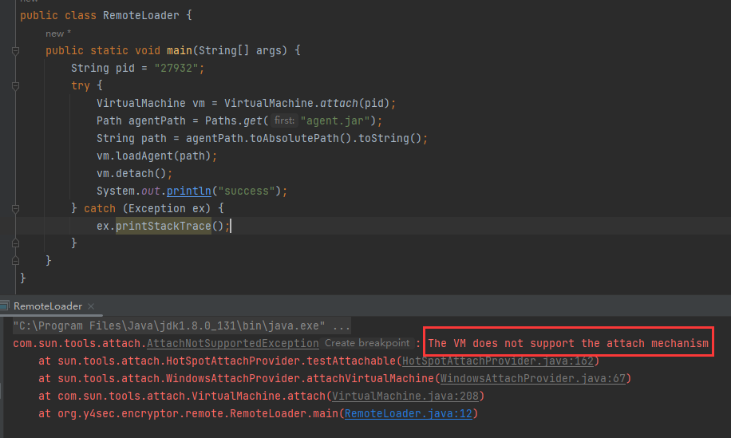
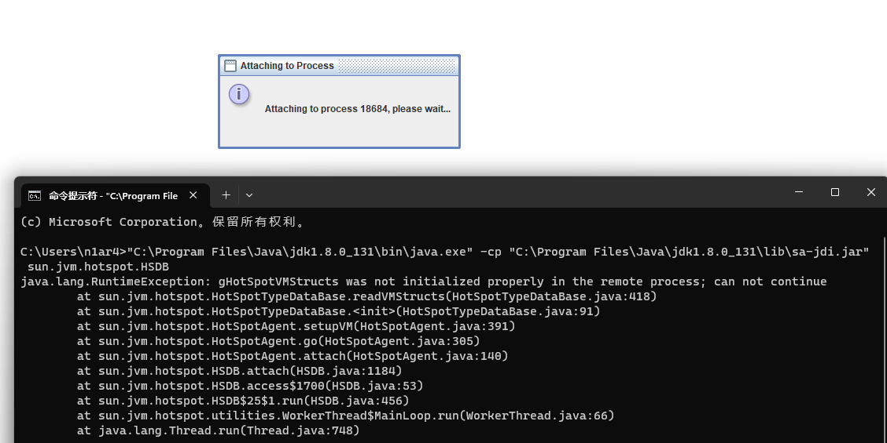
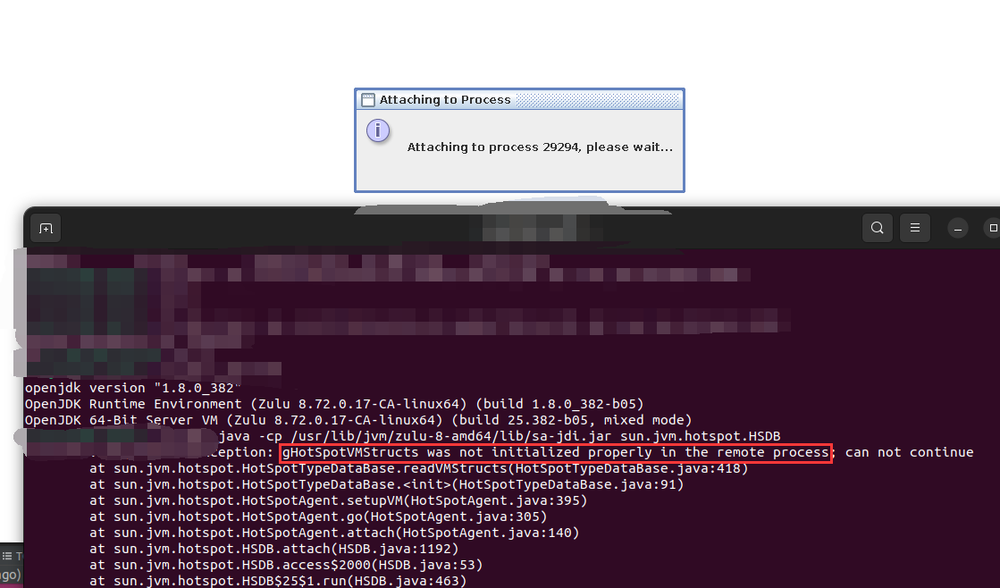

## 进阶

开启 `JVMTI` 加密的混淆效果

（该类是非法字节码无法直接运行也无法反编译）



如果开启该选项，比如启动时指定特殊本地库进行解密

使用 `JNI` 加密字节码，通过 `JVMTI` 解密字节码以保护代码

提供两份 `DLL/SO` 文件，一份加密一份解密，实际运行只需使用解密 `DLL/SO` 文件，支持自定义密钥和包名

```shell
java -XX:+DisableAttachMechanism -agentpath:decrypter.dll=PACKAGE_NAME=com.your.pack,KEY=your-key -jar your-jar.jar
```

注意：加密后的 `JAR` 第一次可能无法运行，第二次可以正常运行

加密后的 `CLASS` 文件变成无法解析的畸形文件



除了开头保持了 `MAGIC` 部分，后续是无法解析的字节



使用指定参数启动即可禁止 `Java Agent` 动态 `dump` 字节码



对于更资深的黑客，他们会想到 `sa-jdi` 的 `HSDB` 来 `dump` 字节码

我参考 `Beichen` 师傅议题的思路，从 `JVM` 里禁用了 `gHotSpotVMStructs` 函数

支持 `Windows` 系统



支持 `Linux` 系统



注意：可能不适用于启动扫描 `class` 的项目（典型的项目比如 `SpringBoot` 等）