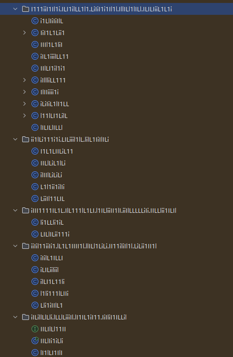
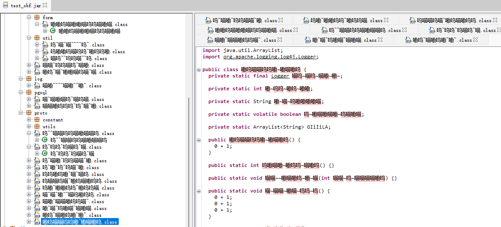

## 效果

测试类

```java
package com.test;

public class Hello {
    private static void add(int a, int b) {
        int c = a + b;
        System.out.println("a + b = " + c);
    }

    public static void main(String[] args) {
        add(1, 2);
    }
}
```

混淆后 `main` 方法部分指令 (全部指令过长不便显示)

```java
public static main([Ljava/lang/String;)V
    LDC 50917067
    LDC 133762565
    ICONST_0
    ICONST_1
    IADD
    POP
    IXOR
    LDC 83446414
    LDC 567873
    ICONST_0
    ICONST_1
    IADD
    POP
    IXOR
    ICONST_0
    ICONST_1
    IADD
    // ...
    POP
    POP
    POP
    INVOKESTATIC com/test/Ll1L1IlIIii.lLil1Ll11l1 (II)V
    // ...
```

混淆后 `main` 方法代码

```java
public static void main(String[] lLiIIiIiLlI) {
    int var10002 = 0 + 1;
    int var10000 = 50917067 ^ 133762565;
    int var10003 = 0 + 1;
    int var10001 = 83446414 ^ 567873;
    var10002 = 0 + 1;
    var10000 ^= var10001;
    var10003 = 0 + 1;
    var10001 = 44140772 ^ 109412867;
    int var10004 = 0 + 1;
    var10002 = 25080190 ^ 89832347;
    var10003 = 0 + 1;
    var10001 ^= var10002;
    int var10005 = 54 + 5 - 3;
    byte var1 = 54;
    lLil1Ll11l1(var10000, var10001);
    var10000 = 0 + 1;
}
```

对于字符串 `"a + b = "` 的混淆

```java
// ...
private static ArrayList<String> GIiIiLA;
// ...
// 全局数组提取
String var5 = (String)GIiIiLA.get(var10003);
var10006 = 74 + 5 - 3;
byte var6 = 74;
// AES解密
var5 = i1LL1iLiLI.I(var5);
var10006 = 9 + 5 - 3;
var6 = 9;
// 字符串拼接
var10001 = var10001.append(var5);
//...
static {
    int var10001 = 0 + 1;
    int var10005 = 57 + 5 - 3;
    byte var10004 = 57;
    GIiIiLA = new ArrayList();
    var10005 = 99 + 5 - 3;
    var10004 = 99;
    // 全局数组初始化
    GIiIiLA.add("ahKHK3TcdrEge+jLkE23xg==");
    var10001 = 0 + 1;
    int var10000 = 0 + 1;
}
```

包名类名的混淆效果



通过定义配置文件的 `obfuscateChars` 可以做更有趣的混淆

